# CLAUDE.md - AI小说生成工具

本文件为AI小说生成工具项目的核心文档，提供开发指南和架构概览。

## 项目愿景

AI小说生成工具致力于成为一个智能化的小说创作辅助平台，通过大语言模型技术帮助作者：
- 快速构建完整小说架构
- 智能生成章节内容
- 维护长篇作品的逻辑一致性
- 提供角色管理和剧情追踪
- 支持多语言模型接入

## 模块结构图

```mermaid
graph TD
    A["(根) AI_NovelGenerator"] --> B["main.py"];
    A --> C["novel_generator/"];
    A --> D["ui/"];
    A --> E["核心配置"];
    A --> F["工具模块"];
    A --> G["测试模块"];
    A --> H["docs/"];

    C --> C1["__init__.py"];
    C --> C2["common.py"];
    C --> C3["architecture.py"];
    C --> C4["blueprint.py"];
    C --> C5["chapter.py"];
    C --> C6["finalization.py"];
    C --> C7["vectorstore_utils.py"];
    C --> C8["knowledge.py"];
    C --> C9["wordcount_utils.py"];

    D --> D1["__init__.py"];
    D --> D2["main_window.py"];
    D --> D3["config_tab.py"];
    D --> D4["novel_params_tab.py"];
    D --> D5["setting_tab.py"];
    D --> D6["directory_tab.py"];
    D --> D7["character_tab.py"];
    D --> D8["summary_tab.py"];
    D --> D9["chapters_tab.py"];
    D --> D10["generation_handlers.py"];
    D --> D11["other_settings.py"];
    D --> D12["context_menu.py"];
    D --> D13["helpers.py"];
    D --> D14["main_tab.py"];
    D --> D15["role_library.py"];

    E --> E1["config_manager.py"];
    E --> E2["llm_adapters.py"];
    E --> E3["embedding_adapters.py"];
    E --> E4["prompt_definitions.py"];
    E --> E5["chapter_directory_parser.py"];

    F --> F1["utils.py"];
    F --> F2["tooltips.py"];

    G --> G1["test_*.py"];

    H --> H1["README_NEW.md"];
    H --> H2["DEVELOPMENT.md"];
    H --> H3["USER_MANUAL.md"];
    H --> H4["API_REFERENCE.md"];
    H --> H5["DEPLOYMENT.md"];
    H --> H6["DOCUMENTATION_INDEX.md"];

    click C "./novel_generator/CLAUDE.md" "查看 novel_generator 模块文档"
    click D "./ui/CLAUDE.md" "查看 ui 模块文档"
    click H "./docs/CLAUDE.md" "查看 docs 模块文档"
```



## 模块索引

| 模块路径 | 职责描述 | 主要文件 | 测试覆盖 | CLAUDE.md |
|---------|---------|----------|----------|-----------|
| `novel_generator/` | 核心业务逻辑 | 架构生成、蓝图创建、章节写作 | 部分覆盖 | [查看](./novel_generator/CLAUDE.md) |
| `ui/` | 图形用户界面 | CustomTkinter界面组件 | 未覆盖 | [查看](./ui/CLAUDE.md) |
| `docs/` | 项目文档 | 用户手册、开发指南 | N/A | [查看](./docs/CLAUDE.md) |
| 核心配置 | 系统配置与适配 | config_manager、llm_adapters | 部分覆盖 | 本文档 |
| 工具模块 | 通用功能 | utils、tooltips | 未覆盖 | 本文档 |
| 测试模块 | 质量保证 | test_*.py文件 | 活跃开发 | 本文档 |

## 运行与开发

### 环境要求
```bash
Python 3.8+
CustomTkinter 5.2.2+
ChromaDB 1.0+
LangChain 0.3+
```

### 快速启动
```bash
# 安装依赖
pip install -r requirements.txt

# 启动应用
python main.py

# 打包为可执行文件
pyinstaller main.spec
```

### 配置设置
1. 复制 `config.example.json` 为 `config.json`
2. 配置API密钥和模型参数
3. 设置小说输出目录
4. 选择合适的LLM服务

### 开发调试
```bash
# 运行单元测试
python test_single_chapter.py
python test_auto_consistency.py

# 性能分析
python performance_analysis.py

# 一致性检查
python check_consistency.py
```

## 测试策略

### 单元测试
- 章节生成逻辑测试
- 配置管理测试
- LLM适配器测试
- 向量存储测试

### 集成测试
- 端到端小说生成流程
- 多LLM服务集成
- GUI界面响应测试

### 性能测试
- 生成速度基准测试
- 内存使用监控
- 并发处理能力测试

## 编码规范

### 命名约定
- 类名: PascalCase (例: NovelGeneratorGUI)
- 函数名: snake_case (例: generate_chapter_draft)
- 常量: UPPER_CASE (例: MAX_RETRIES)
- 文件名: snake_case (例: chapter_blueprint.py)

### 代码组织
- 单一职责原则
- 依赖注入模式
- 接口隔离原则
- 配置外部化

### 注释标准
- 所有公共函数必须有docstring
- 复杂逻辑添加行内注释
- 使用类型提示
- 关键算法说明

## AI使用指引

### 开发辅助
- 使用AI进行代码重构建议
- 依赖版本兼容性检查
- 性能瓶颈分析
- 测试用例生成

### 禁止事项
- 不提交API密钥到版本控制
- 不依赖AI生成核心业务逻辑
- 不自动合并AI建议的代码
- 不使用AI处理敏感配置

## 变更记录 (Changelog)

### 2025-11-09
- 初始化AI上下文文档
- 添加Mermaid模块结构图
- 创建模块级文档框架
- 建立导航面包屑系统

### 历史更新
详见git提交记录和各模块CHANGELOG

---

**注意**: 本文档是动态更新的，每次重要架构变更或功能迭代都应同步更新。新功能开发前请先阅读相关模块文档。