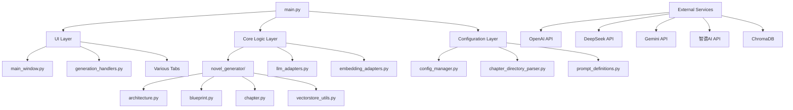

# 开发者文档

本文档为AI小说生成工具的开发者提供详细的技术指南，包括项目架构、核心模块API、扩展开发指南和贡献流程。

## 📋 目录

- [项目架构](#项目架构)
- [核心模块详解](#核心模块详解)
- [开发环境搭建](#开发环境搭建)
- [扩展开发指南](#扩展开发指南)
- [测试指南](#测试指南)
- [代码规范](#代码规范)
- [贡献流程](#贡献流程)
- [常见开发问题](#常见开发问题)

## 🏗️ 项目架构

### 整体架构图



### 设计模式

#### 1. 适配器模式 (Adapter Pattern)
统一不同LLM服务的接口，使系统能够无缝切换不同的AI服务提供商。

```python
# llm_adapters.py
class BaseLLMAdapter(ABC):
    @abstractmethod
    async def generate(self, prompt: str, **kwargs) -> str:
        pass

    @abstractmethod
    def get_rate_limit(self) -> dict:
        pass

class OpenAIAdapter(BaseLLMAdapter):
    async def generate(self, prompt: str, **kwargs) -> str:
        # OpenAI specific implementation
        pass

class DeepSeekAdapter(BaseLLMAdapter):
    async def generate(self, prompt: str, **kwargs) -> str:
        # DeepSeek specific implementation
        pass
```

#### 2. 工厂模式 (Factory Pattern)
根据配置动态创建相应的适配器实例。

```python
# llm_adapters.py
def create_llm_adapter(config: dict) -> BaseLLMAdapter:
    interface_format = config.get("interface_format", "OpenAI")

    adapter_map = {
        "OpenAI": OpenAIAdapter,
        "DeepSeek": DeepSeekAdapter,
        "智谱AI": GLMAdapter,
        "Gemini": GeminiAdapter
    }

    adapter_class = adapter_map.get(interface_format)
    if not adapter_class:
        raise ValueError(f"Unsupported interface format: {interface_format}")

    return adapter_class(config)
```

#### 3. MVC模式 (Model-View-Controller)
分离业务逻辑、数据和界面表示。

- **Model**: `novel_generator/` 模块处理核心业务逻辑
- **View**: `ui/` 模块处理界面展示
- **Controller**: `generation_handlers.py` 处理用户交互和业务流程

## 🔧 核心模块详解

### 1. 配置管理 (config_manager.py)

负责应用配置的加载、保存和管理，支持热重载。

```python
class ConfigManager:
    def __init__(self, config_file: str = "config.json"):
        self.config_file = config_file
        self.config = {}
        self.lock = threading.RLock()
        self.load_config()

    def load_config(self) -> dict:
        """加载配置文件"""
        with self.lock:
            if not os.path.exists(self.config_file):
                self.create_default_config()

            try:
                with open(self.config_file, 'r', encoding='utf-8') as f:
                    self.config = json.load(f)
            except Exception as e:
                logger.error(f"配置文件加载失败: {e}")
                self.config = {}

        return self.config

    def save_config(self, config: dict = None):
        """保存配置到文件"""
        with self.lock:
            if config:
                self.config.update(config)

            try:
                with open(self.config_file, 'w', encoding='utf-8') as f:
                    json.dump(self.config, f, indent=2, ensure_ascii=False)
            except Exception as e:
                logger.error(f"配置文件保存失败: {e}")
```

**关键功能**:
- 自动创建默认配置文件
- 线程安全的配置读写
- 支持配置热重载
- API密钥安全管理

### 2. LLM适配器系统 (llm_adapters.py)

提供统一的LLM服务接口，支持多种AI服务提供商。

```python
class OpenAIAdapter(BaseLLMAdapter):
    def __init__(self, config: dict):
        self.client = AsyncOpenAI(
            api_key=config["api_key"],
            base_url=config["base_url"],
            timeout=config.get("timeout", 600)
        )
        self.model_name = config["model_name"]
        self.temperature = config.get("temperature", 0.7)
        self.max_tokens = config.get("max_tokens", 8192)

    async def generate(self, prompt: str, **kwargs) -> str:
        """生成文本"""
        try:
            response = await self.client.chat.completions.create(
                model=self.model_name,
                messages=[{"role": "user", "content": prompt}],
                temperature=kwargs.get("temperature", self.temperature),
                max_tokens=kwargs.get("max_tokens", self.max_tokens)
            )
            return response.choices[0].message.content
        except Exception as e:
            logger.error(f"OpenAI API调用失败: {e}")
            raise
```

**支持的服务提供商**:
- OpenAI (GPT系列)
- DeepSeek V3
- Gemini 2.5 Pro
- 智谱AI (GLM-4.6)

### 3. 章节生成核心 (novel_generator/)

#### architecture.py - 世界观生成
负责生成小说的世界观设定，包括背景设定、规则体系等。

```python
class NovelArchitectureGenerator:
    def __init__(self, llm_adapter: BaseLLMAdapter):
        self.llm_adapter = llm_adapter

    async def generate_worldview(self, genre: str, theme: str, style: str) -> dict:
        """生成世界观设定"""
        prompt = f"""
        请为以下类型的小说生成世界观设定：
        - 类型：{genre}
        - 主题：{theme}
        - 风格：{style}

        请包含以下方面：
        1. 世界背景设定
        2. 核心规则体系
        3. 社会结构
        4. 科技水平
        5. 文化特色
        """

        response = await self.llm_adapter.generate(prompt)
        return self.parse_worldview_response(response)
```

#### blueprint.py - 剧情蓝图生成
生成详细的章节剧情蓝图，支持严格模式确保内容完整性。

```python
class StrictBlueprintGenerator:
    def __init__(self, llm_adapter: BaseLLMAdapter):
        self.llm_adapter = llm_adapter
        self.max_retries = 5

    async def generate_chapter_blueprint(
        self,
        chapter_info: dict,
        world_context: dict,
        previous_chapters: list
    ) -> dict:
        """生成章节蓝图（严格模式）"""

        for attempt in range(self.max_retries):
            try:
                blueprint = await self._generate_single_blueprint(
                    chapter_info, world_context, previous_chapters
                )

                # 零容忍验证
                if self._validate_blueprint_completeness(blueprint):
                    return blueprint
                else:
                    logger.warning(f"蓝图不完整，第 {attempt + 1} 次重试")

            except Exception as e:
                logger.error(f"蓝图生成失败，第 {attempt + 1} 次重试: {e}")

        raise Exception("章节蓝图生成失败，已达到最大重试次数")

    def _validate_blueprint_completeness(self, blueprint: dict) -> bool:
        """验证蓝图完整性"""
        forbidden_patterns = ['...', '…', '省略', '待定']
        blueprint_text = str(blueprint)

        for pattern in forbidden_patterns:
            if pattern in blueprint_text:
                return False

        # 检查必要字段
        required_fields = ['chapter_title', 'core_conflict', 'chapter_outline']
        return all(field in blueprint for field in required_fields)
```

#### chapter.py - 章节内容生成
结合向量检索生成完整的章节内容。

```python
class ChapterGenerator:
    def __init__(self, llm_adapter: BaseLLMAdapter, vectorstore: ChromaDB):
        self.llm_adapter = llm_adapter
        self.vectorstore = vectorstore

    async def generate_chapter_draft(
        self,
        chapter_blueprint: dict,
        novel_context: dict,
        word_count_target: int
    ) -> str:
        """生成章节草稿"""

        # 1. 检索相关历史内容
        relevant_context = await self._retrieve_relevant_context(chapter_blueprint)

        # 2. 构建生成提示
        prompt = self._build_generation_prompt(
            chapter_blueprint, novel_context, relevant_context, word_count_target
        )

        # 3. 生成章节内容
        content = await self.llm_adapter.generate(prompt)

        # 4. 验证内容完整性
        if self._validate_chapter_completeness(content):
            return content
        else:
            # 自动重试或修复
            return await self._repair_chapter_content(content, chapter_blueprint)
```

#### vectorstore_utils.py - 向量数据库管理
使用ChromaDB管理长程上下文和语义检索。

```python
class VectorStoreManager:
    def __init__(self, persist_directory: str = "./vectorstore"):
        self.client = chromadb.PersistentClient(path=persist_directory)
        self.collection = self.client.get_or_create_collection(
            name="novel_chapters",
            metadata={"description": "小说章节向量存储"}
        )

    async def add_chapter(
        self,
        chapter_id: str,
        chapter_content: str,
        metadata: dict
    ):
        """添加章节到向量存储"""
        # 生成向量嵌入
        embedding = await self._generate_embedding(chapter_content)

        # 添加到集合
        self.collection.add(
            ids=[chapter_id],
            embeddings=[embedding],
            documents=[chapter_content],
            metadatas=[metadata]
        )

    async def search_relevant_content(
        self,
        query: str,
        n_results: int = 5
    ) -> list:
        """搜索相关内容"""
        query_embedding = await self._generate_embedding(query)

        results = self.collection.query(
            query_embeddings=[query_embedding],
            n_results=n_results
        )

        return results

    async def _generate_embedding(self, text: str) -> list:
        """生成文本向量嵌入"""
        # 使用配置的embedding适配器
        embedding_adapter = create_embedding_adapter(self.config)
        return await embedding_adapter.generate(text)
```

### 4. 用户界面系统 (ui/)

#### main_window.py - 主窗口
基于CustomTkinter的现代化GUI主窗口。

```python
class NovelGeneratorGUI:
    def __init__(self, root: ctk.CTk):
        self.root = root
        self.root.title("AI小说生成工具")
        self.root.geometry("1200x800")

        # 初始化配置
        self.config_manager = ConfigManager()

        # 设置主题
        self.setup_theme()

        # 创建主界面
        self.setup_main_layout()

        # 创建标签页
        self.setup_tabs()

    def setup_main_layout(self):
        """设置主布局"""
        # 侧边栏
        self.sidebar = ctk.CTkFrame(self.root, width=200)
        self.sidebar.pack(side="left", fill="y", padx=5, pady=5)

        # 主内容区域
        self.main_content = ctk.CTkFrame(self.root)
        self.main_content.pack(side="right", fill="both", expand=True, padx=5, pady=5)

    def setup_tabs(self):
        """设置功能标签页"""
        self.tabview = ctk.CTkTabview(self.main_content)
        self.tabview.pack(fill="both", expand=True)

        # 创建各个功能标签页
        self.config_tab = ConfigTab(self.tabview, self.config_manager)
        self.novel_params_tab = NovelParamsTab(self.tabview)
        self.setting_tab = SettingTab(self.tabview)
        self.directory_tab = DirectoryTab(self.tabview)
        self.chapters_tab = ChaptersTab(self.tabview)
        # ... 其他标签页
```

## 🛠️ 开发环境搭建

### 1. 环境要求

- Python 3.8+
- Windows 10/11 或 Linux/macOS
- Git
- 推荐使用虚拟环境

### 2. 克隆项目

```bash
git clone https://github.com/your-username/AI_NovelGenerator.git
cd AI_NovelGenerator
```

### 3. 创建虚拟环境

```bash
# 使用venv
python -m venv venv

# Windows激活
venv\Scripts\activate

# Linux/macOS激活
source venv/bin/activate
```

### 4. 安装依赖

```bash
pip install -r requirements.txt
```

### 5. 配置开发环境

```bash
# 复制配置模板
cp config.example.json config.json

# 编辑配置文件，添加开发环境的API密钥
```

### 6. 运行开发服务器

```bash
python main.py
```

### 7. 运行测试

```bash
# 运行所有测试
python -m pytest tests/

# 运行特定测试
python test_single_chapter.py

# 运行一致性测试
python test_auto_consistency.py
```

## 🔌 扩展开发指南

### 1. 添加新的LLM服务提供商

#### 步骤1: 创建适配器类

在 `llm_adapters.py` 中创建新的适配器：

```python
class NewLLMAdapter(BaseLLMAdapter):
    def __init__(self, config: dict):
        self.api_key = config["api_key"]
        self.base_url = config["base_url"]
        self.model_name = config["model_name"]
        # 初始化API客户端

    async def generate(self, prompt: str, **kwargs) -> str:
        """实现具体的API调用逻辑"""
        try:
            # 调用新LLM服务的API
            response = await self.api_client.generate(
                prompt=prompt,
                model=self.model_name,
                **kwargs
            )
            return response.text
        except Exception as e:
            logger.error(f"新LLM服务调用失败: {e}")
            raise

    def get_rate_limit(self) -> dict:
        """返回该服务的频率限制信息"""
        return {
            "requests_per_hour": 1000,
            "tokens_per_minute": 60000,
            "min_interval": 1  # 秒
        }
```

#### 步骤2: 注册适配器

在 `create_llm_adapter` 函数中注册新适配器：

```python
def create_llm_adapter(config: dict) -> BaseLLMAdapter:
    interface_format = config.get("interface_format", "OpenAI")

    adapter_map = {
        "OpenAI": OpenAIAdapter,
        "DeepSeek": DeepSeekAdapter,
        "智谱AI": GLMAdapter,
        "Gemini": GeminiAdapter,
        "新LLM服务": NewLLMAdapter  # 添加新适配器
    }

    # ... 其余代码
```

#### 步骤3: 更新配置模板

在 `config.example.json` 中添加新服务的配置模板：

```json
{
  "llm_configs": {
    "新LLM服务": {
      "api_key": "",
      "base_url": "https://api.newllm.com/v1",
      "model_name": "newllm-latest",
      "temperature": 0.7,
      "max_tokens": 8192,
      "timeout": 600,
      "interface_format": "新LLM服务"
    }
  }
}
```

### 2. 添加新的生成功能模块

#### 步骤1: 创建核心模块

在 `novel_generator/` 目录下创建新模块：

```python
# novel_generator/new_feature.py
import asyncio
import logging
from typing import Dict, List, Optional
from .common import call_with_retry

logger = logging.getLogger(__name__)

class NewFeatureGenerator:
    def __init__(self, llm_adapter: BaseLLMAdapter):
        self.llm_adapter = llm_adapter

    async def generate_new_content(self, params: dict) -> dict:
        """生成新功能的内容"""
        try:
            # 实现生成逻辑
            result = await call_with_retry(
                self.llm_adapter.generate,
                prompt=self._build_prompt(params),
                max_retries=3
            )

            return self._parse_result(result)

        except Exception as e:
            logger.error(f"新功能生成失败: {e}")
            raise

    def _build_prompt(self, params: dict) -> str:
        """构建生成提示"""
        # 构建特定的提示词
        return f"""
        请基于以下参数生成内容：
        {params}
        """

    def _parse_result(self, result: str) -> dict:
        """解析生成结果"""
        # 解析LLM返回的结果
        return {"content": result}
```

#### 步骤2: 添加UI界面

在 `ui/` 目录下创建新的标签页：

```python
# ui/new_feature_tab.py
import customtkinter as ctk
import asyncio
from typing import Dict, Any

class NewFeatureTab(ctk.CTkFrame):
    def __init__(self, parent, config_manager):
        super().__init__(parent)
        self.config_manager = config_manager

        self.setup_ui()

    def setup_ui(self):
        """设置UI界面"""
        # 创建输入控件
        self.create_input_widgets()

        # 创建生成按钮
        self.generate_button = ctk.CTkButton(
            self,
            text="生成",
            command=self.on_generate_clicked
        )
        self.generate_button.pack(pady=10)

        # 创建结果展示区域
        self.create_result_widgets()

    def create_input_widgets(self):
        """创建输入控件"""
        # 实现具体的输入控件
        pass

    def create_result_widgets(self):
        """创建结果展示控件"""
        # 实现结果展示控件
        pass

    def on_generate_clicked(self):
        """生成按钮点击事件"""
        try:
            # 获取输入参数
            params = self.get_input_params()

            # 异步执行生成任务
            asyncio.create_task(self.generate_content(params))

        except Exception as e:
            self.show_error(f"生成失败: {e}")

    async def generate_content(self, params: Dict[str, Any]):
        """异步生成内容"""
        try:
            # 显示加载状态
            self.show_loading()

            # 执行生成
            generator = NewFeatureGenerator(self.get_llm_adapter())
            result = await generator.generate_new_content(params)

            # 显示结果
            self.show_result(result)

        except Exception as e:
            self.show_error(f"生成失败: {e}")
        finally:
            self.hide_loading()
```

#### 步骤3: 集成到主界面

在 `main_window.py` 中集成新标签页：

```python
def setup_tabs(self):
    """设置功能标签页"""
    self.tabview = ctk.CTkTabview(self.main_content)
    self.tabview.pack(fill="both", expand=True)

    # 现有标签页
    self.config_tab = ConfigTab(self.tabview, self.config_manager)
    # ...

    # 添加新标签页
    self.new_feature_tab = NewFeatureTab(self.tabview, self.config_manager)
```

### 3. 扩展一致性检查功能

```python
# 新的一致性检查器
class CustomConsistencyChecker:
    def __init__(self):
        self.check_rules = []

    def add_check_rule(self, rule_func, name: str, description: str):
        """添加自定义检查规则"""
        self.check_rules.append({
            'function': rule_func,
            'name': name,
            'description': description
        })

    def check_consistency(self, content: str, context: dict) -> list:
        """执行一致性检查"""
        issues = []

        for rule in self.check_rules:
            try:
                result = rule['function'](content, context)
                if not result['is_consistent']:
                    issues.append({
                        'rule_name': rule['name'],
                        'description': rule['description'],
                        'issue': result['issue'],
                        'suggestion': result['suggestion']
                    })
            except Exception as e:
                logger.error(f"检查规则 {rule['name']} 执行失败: {e}")

        return issues

# 使用示例
def check_timeline_consistency(content: str, context: dict) -> dict:
    """检查时间线一致性"""
    # 实现具体的时间线检查逻辑
    return {
        'is_consistent': True,
        'issue': None,
        'suggestion': None
    }

# 注册检查规则
checker = CustomConsistencyChecker()
checker.add_check_rule(
    check_timeline_consistency,
    "时间线一致性",
    "检查章节内容与整体时间线的一致性"
)
```

## 🧪 测试指南

### 1. 单元测试

```python
# tests/test_llm_adapters.py
import pytest
import asyncio
from llm_adapters import OpenAIAdapter, create_llm_adapter

class TestLLMAdapters:
    @pytest.fixture
    def openai_config(self):
        return {
            "api_key": "test_key",
            "base_url": "https://api.openai.com/v1",
            "model_name": "gpt-3.5-turbo",
            "interface_format": "OpenAI"
        }

    def test_create_openai_adapter(self, openai_config):
        adapter = create_llm_adapter(openai_config)
        assert isinstance(adapter, OpenAIAdapter)

    @pytest.mark.asyncio
    async def test_generate_text(self, openai_config):
        adapter = create_llm_adapter(openai_config)
        # Mock API call for testing
        with pytest.MockOpenAI():
            result = await adapter.generate("Test prompt")
            assert isinstance(result, str)
            assert len(result) > 0
```

### 2. 集成测试

```python
# tests/test_integration.py
import pytest
import asyncio
from novel_generator import NovelArchitectureGenerator
from llm_adapters import create_llm_adapter

class TestIntegration:
    @pytest.fixture
    def llm_adapter(self):
        config = {
            "api_key": "test_key",
            "model_name": "test-model",
            "interface_format": "OpenAI"
        }
        return create_llm_adapter(config)

    @pytest.mark.asyncio
    async def test_worldview_generation(self, llm_adapter):
        generator = NovelArchitectureGenerator(llm_adapter)

        with pytest.MockLLM():
            worldview = await generator.generate_worldview(
                genre="科幻",
                theme="人工智能",
                style="现实主义"
            )

            assert isinstance(worldview, dict)
            assert "world_background" in worldview
            assert "social_structure" in worldview
```

### 3. 运行测试

```bash
# 运行所有测试
python -m pytest tests/ -v

# 运行特定测试文件
python -m pytest tests/test_llm_adapters.py -v

# 运行带覆盖率的测试
python -m pytest tests/ --cov=.

# 生成覆盖率报告
python -m pytest tests/ --cov=. --cov-report=html
```

## 📝 代码规范

### 1. Python代码风格

遵循 PEP 8 规范：

```python
# 导入顺序：标准库 -> 第三方库 -> 本地模块
import asyncio
import logging
from typing import Dict, List, Optional

import chromadb
import customtkinter as ctk

from novel_generator import common
from ui import main_window

# 类名使用 PascalCase
class NovelGenerator:
    pass

# 函数和变量使用 snake_case
def generate_chapter_content():
    chapter_content = ""
    return chapter_content

# 常量使用 UPPER_CASE
MAX_RETRIES = 5
DEFAULT_TEMPERATURE = 0.7
```

### 2. 类型注解

所有函数都应该有类型注解：

```python
from typing import Dict, List, Optional, Union

async def generate_chapter(
    chapter_info: Dict[str, Any],
    world_context: Dict[str, Any],
    word_count_target: int = 2000
) -> Optional[str]:
    """
    生成章节内容

    Args:
        chapter_info: 章节信息字典
        world_context: 世界观上下文
        word_count_target: 目标字数

    Returns:
        生成的章节内容，失败时返回None
    """
    pass
```

### 3. 文档字符串

使用Google风格的文档字符串：

```python
class ChapterGenerator:
    """章节生成器

    负责基于剧情蓝图和上下文信息生成章节内容。
    支持向量检索增强和一致性验证。

    Attributes:
        llm_adapter: LLM适配器实例
        vectorstore: 向量数据库实例
        max_retries: 最大重试次数
    """

    def __init__(
        self,
        llm_adapter: BaseLLMAdapter,
        vectorstore: VectorStoreManager,
        max_retries: int = 5
    ):
        """初始化章节生成器

        Args:
            llm_adapter: LLM适配器实例
            vectorstore: 向量数据库实例
            max_retries: 生成失败时的最大重试次数
        """
        self.llm_adapter = llm_adapter
        self.vectorstore = vectorstore
        self.max_retries = max_retries

    async def generate_chapter_draft(
        self,
        chapter_blueprint: Dict[str, Any],
        novel_context: Dict[str, Any]
    ) -> str:
        """生成章节草稿

        基于剧情蓝图和小说上下文生成章节内容。
        会自动检索相关历史内容并进行一致性验证。

        Args:
            chapter_blueprint: 章节剧情蓝图
            novel_context: 小说整体上下文信息

        Returns:
            生成的章节草稿内容

        Raises:
            GenerationError: 当生成失败且重试次数用尽时
            ValidationError: 当生成内容未通过验证时
        """
        pass
```

### 4. 错误处理

```python
import logging
from typing import Optional

logger = logging.getLogger(__name__)

class NovelGenerationError(Exception):
    """小说生成相关错误的基类"""
    pass

class APIError(NovelGenerationError):
    """API调用错误"""
    pass

class ValidationError(NovelGenerationError):
    """验证错误"""
    pass

async def safe_generate_content(prompt: str) -> Optional[str]:
    """安全的生成内容函数"""
    try:
        result = await llm_adapter.generate(prompt)
        return result
    except APIError as e:
        logger.error(f"API调用失败: {e}")
        return None
    except ValidationError as e:
        logger.warning(f"内容验证失败: {e}")
        return None
    except Exception as e:
        logger.error(f"未知错误: {e}")
        return None
```

## 🔄 贡献流程

### 1. Fork项目

1. 访问项目主页：https://github.com/your-username/AI_NovelGenerator
2. 点击右上角的"Fork"按钮
3. 等待Fork完成

### 2. 克隆Fork的项目

```bash
git clone https://github.com/your-username/AI_NovelGenerator.git
cd AI_NovelGenerator
```

### 3. 创建开发分支

```bash
# 创建并切换到新分支
git checkout -b feature/your-feature-name

# 或者切换到现有分支
git checkout feature/existing-feature
```

### 4. 进行开发

1. 按照上述代码规范进行开发
2. 添加必要的测试
3. 确保所有测试通过
4. 更新相关文档

### 5. 提交代码

```bash
# 添加修改的文件
git add .

# 提交代码
git commit -m "feat: 添加新功能描述

- 详细说明修改内容
- 影响的模块
- 相关的issue编号"

# 推送到远程仓库
git push origin feature/your-feature-name
```

### 6. 创建Pull Request

1. 访问GitHub上的Fork项目页面
2. 点击"New Pull Request"按钮
3. 选择源分支和目标分支
4. 填写PR描述：
   - 功能概述
   - 修改详情
   - 测试情况
   - 相关截图（如果适用）
5. 提交Pull Request

### 7. 代码审查

1. 等待维护者审查代码
2. 根据反馈进行修改
3. 更新PR
4. 重复直到合并

## ❓ 常见开发问题

### 1. API密钥配置问题

**问题**: API调用失败，提示密钥错误

**解决方案**:
```python
# 检查配置文件加载
config_manager = ConfigManager()
config = config_manager.load_config()

# 验证API密钥格式
api_key = config.get("llm_configs", {}).get("OpenAI", {}).get("api_key")
if not api_key or len(api_key) < 10:
    raise ValueError("API密钥格式不正确")

# 测试API连接
try:
    adapter = create_llm_adapter(config["llm_configs"]["OpenAI"])
    result = await adapter.generate("测试连接")
    print("API连接成功")
except Exception as e:
    print(f"API连接失败: {e}")
```

### 2. 向量数据库问题

**问题**: ChromaDB连接失败或检索结果异常

**解决方案**:
```python
# 检查向量数据库状态
try:
    client = chromadb.PersistentClient(path="./vectorstore")
    collection = client.get_collection("novel_chapters")
    print(f"向量数据库连接成功，文档数量: {collection.count()}")
except Exception as e:
    print(f"向量数据库连接失败: {e}")

    # 重新初始化数据库
    client = chromadb.PersistentClient(path="./vectorstore")
    collection = client.create_collection("novel_chapters")
    print("向量数据库重新初始化成功")
```

### 3. GUI界面问题

**问题**: CustomTkinter界面显示异常或卡顿

**解决方案**:
```python
# 使用线程处理耗时操作
import threading

def on_generate_clicked(self):
    def generate_in_thread():
        try:
            # 在子线程中执行耗时操作
            result = generate_chapter_content()

            # 在主线程中更新UI
            self.root.after(0, lambda: self.update_ui(result))
        except Exception as e:
            self.root.after(0, lambda: self.show_error(str(e)))

    # 启动子线程
    thread = threading.Thread(target=generate_in_thread)
    thread.daemon = True
    thread.start()
```

### 4. 性能优化问题

**问题**: 大批量生成时性能较慢

**解决方案**:
```python
# 使用异步并发生成
import asyncio

async def batch_generate_chapters(chapters: List[Dict]) -> List[str]:
    """批量生成章节"""
    semaphore = asyncio.Semaphore(3)  # 限制并发数

    async def generate_with_limit(chapter_info):
        async with semaphore:
            return await generate_chapter(chapter_info)

    tasks = [generate_with_limit(chapter) for chapter in chapters]
    results = await asyncio.gather(*tasks, return_exceptions=True)

    return [r for r in results if not isinstance(r, Exception)]

# 使用缓存机制
from functools import lru_cache

@lru_cache(maxsize=100)
def get_cached_embedding(text: str) -> list:
    """获取缓存的向量嵌入"""
    return generate_embedding(text)
```

### 5. 调试技巧

```python
# 启用详细日志
import logging

logging.basicConfig(
    level=logging.DEBUG,
    format='%(asctime)s - %(name)s - %(levelname)s - %(message)s',
    handlers=[
        logging.FileHandler('debug.log', encoding='utf-8'),
        logging.StreamHandler()
    ]
)

# 使用调试装饰器
def debug_decorator(func):
    def wrapper(*args, **kwargs):
        logger.debug(f"调用函数 {func.__name__}, 参数: {args}, {kwargs}")
        try:
            result = func(*args, **kwargs)
            logger.debug(f"函数 {func.__name__} 执行成功, 结果: {result}")
            return result
        except Exception as e:
            logger.error(f"函数 {func.__name__} 执行失败: {e}")
            raise
    return wrapper

# 使用断点调试
import pdb

def debug_function():
    pdb.set_trace()  # 设置断点
    # 调试代码
    pass
```

---

## 📞 开发支持

如果您在开发过程中遇到问题，可以通过以下方式获取帮助：

- 📧 技术问题：提交GitHub Issue
- 💬 开发讨论：GitHub Discussions
- 📖 文档反馈：提交文档改进PR
- 🐛 Bug报告：使用Bug Report模板

感谢您对AI小说生成工具项目的贡献！