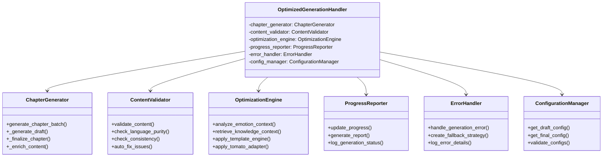

# AI_NovelGenerator 紧急代码重构方案

## 🚨 重构背景

经过深度分析，`ui/generation_handlers.py` 文件存在严重的代码质量问题：

### 关键问题
1. **🔴 极紧急 - 违反单一职责原则**: 单文件1490行，包含多种不同的职责
2. **🟡 高优先级 - 代码维护困难**: 方法过多，逻辑复杂，难以理解和测试
3. **🟡 中优先级 - 缺乏错误处理**: 异常处理不够精细，缺乏统一的错误管理
4. **🟡 低优先级 - 编码规范不统一**: 缺乏类型注解，代码风格不一致

### 风险评估
- **维护成本**: 极高 - 任何修改都可能影响多个功能
- **测试难度**: 极高 - 复杂的依赖关系和状态管理
- **Bug风险**: 高 - 代码复杂度高，容易引入隐藏Bug
- **团队协作困难**: 高 - 单文件冲突频发

## 🎯 重构目标

1. **提升代码质量**: 遵循SOLID原则，提高可维护性
2. **增强可测试性**: 拆分小而专注的类，便于单元测试
3. **改善错误处理**: 统一异常处理机制，提供更好的错误信息
4. **规范编码风格**: 添加类型注解，统一代码格式

## 📋 重构方案

### 1. OptimizedGenerationHandler 职责分析

经过深入分析，`OptimizedGenerationHandler` 承担了以下7种不同的职责：

#### 当前职责清单
1. **章节生成核心逻辑** - 实际的内容生成工作
2. **内容验证和质量控制** - 语言纯度检查、一致性验证
3. **性能优化处理** - 多种优化引擎的集成和应用
4. **进度报告和状态管理** - 进度更新、状态追踪
5. **错误处理和异常管理** - 异常捕获、错误报告
6. **配置管理** - LLM配置获取、参数设置
7. **UI集成和事件处理** - 与GUI界面的交互

### 2. 新的类设计方案

基于单一职责原则，设计以下6个专门的类：



### 3. 各类职责定义

#### ChapterGenerator (章节生成器)
**职责**: 负责实际的章节内容生成逻辑
- `generate_chapter_batch()`: 批量生成章节
- `_generate_draft()`: 生成章节草稿
- `_finalize_chapter()`: 章节定稿处理
- `_enrich_content()`: 内容丰富和扩写
- `_save_chapter_draft()`: 保存章节草稿

#### ContentValidator (内容验证器)
**职责**: 负责内容质量检查和验证
- `validate_content()`: 综合内容验证
- `check_language_purity()`: 语言纯度检查
- `check_consistency()`: 一致性验证
- `auto_fix_issues()`: 自动修复问题

#### OptimizationEngine (优化引擎)
**职责**: 管理各种性能优化功能
- `analyze_emotion_context()`: 情绪上下文分析
- `retrieve_knowledge_context()`: 知识库检索
- `apply_template_engine()`: 模板引擎应用
- `apply_tomato_adapter()`: 番茄平台适配

#### ProgressReporter (进度报告器)
**职责**: 处理进度报告和状态管理
- `update_progress()`: 更新进度信息
- `generate_report()`: 生成优化报告
- `log_generation_status()`: 记录生成状态

#### ErrorHandler (错误处理器)
**职责**: 统一的错误处理和异常管理
- `handle_generation_error()`: 处理生成错误
- `create_fallback_strategy()`: 创建回退策略
- `log_error_details()`: 记录错误详情

#### ConfigurationManager (配置管理器)
**职责**: 管理LLM配置和参数设置
- `get_draft_config()`: 获取草稿配置
- `get_final_config()`: 获取定稿配置
- `validate_configs()`: 验证配置有效性

## 🔧 实施步骤

### 阶段1: 设计接口和基础结构 (1-2天)
1. 定义各类的基础接口
2. 创建基础类结构
3. 设计类之间的交互协议

### 阶段2: 逐个实现专门类 (3-4天)
1. 实现 ConfigurationManager (最基础)
2. 实现 ErrorHandler (错误处理基础)
3. 实现 ChapterGenerator (核心逻辑)
4. 实现 ContentValidator (质量保证)
5. 实现 OptimizationEngine (优化功能)
6. 实现 ProgressReporter (进度管理)

### 阶段3: 重构主处理器 (1-2天)
1. 重构 OptimizedGenerationHandler
2. 集成各个专门类
3. 保持向后兼容性

### 阶段4: 更新相关代码 (1天)
1. 更新导入和使用代码
2. 修改UI界面调用
3. 更新测试代码

### 阶段5: 测试和验证 (1-2天)
1. 单元测试各个新类
2. 集成测试整个系统
3. 性能测试和优化

## 📁 文件结构规划

```
ui/
├── generation_handlers.py              # 重构后的主处理器 (大幅简化)
├── generation/
│   ├── __init__.py
│   ├── chapter_generator.py           # ChapterGenerator 类
│   ├── content_validator.py           # ContentValidator 类
│   ├── optimization_engine.py         # OptimizationEngine 类
│   ├── progress_reporter.py           # ProgressReporter 类
│   ├── error_handler.py               # ErrorHandler 类
│   └── config_manager.py              # ConfigurationManager 类
└── ui_handlers.py                     # UI事件处理函数 (从原文件分离)
```

## 🎯 质量标准

### 代码质量指标
- **类大小**: 每个类不超过300行
- **方法大小**: 每个方法不超过50行
- **圈复杂度**: 每个方法不超过10
- **测试覆盖率**: 目标80%以上

### 编码规范
- 使用类型注解
- 遵循PEP 8规范
- 统一的错误处理模式
- 完善的文档字符串

## ⚠️ 风险控制

### 回退策略
1. **Git分支**: 创建专门的重构分支
2. **版本标记**: 保留原始版本的备份
3. **功能验证**: 每个阶段完成后进行功能验证
4. **回滚计划**: 准备快速回滚到原版本的方案

### 测试策略
1. **单元测试**: 每个新类的独立测试
2. **集成测试**: 类之间协作的测试
3. **回归测试**: 确保原有功能不受影响
4. **性能测试**: 确保重构不影响性能

## 📈 预期收益

### 短期收益
- **代码可读性提升**: 单一职责，逻辑清晰
- **维护成本降低**: 修改影响范围明确
- **测试覆盖率提升**: 小类更容易测试

### 长期收益
- **团队协作改善**: 减少代码冲突
- **功能扩展便利**: 新功能更容易集成
- **技术债务减少**: 提升整体代码质量

## 🗓️ 时间计划

| 阶段 | 任务 | 预计时间 | 状态 |
|------|------|----------|------|
| 1 | 设计接口和基础结构 | 1-2天 | 📋 待开始 |
| 2 | 实现专门类 | 3-4天 | 📋 待开始 |
| 3 | 重构主处理器 | 1-2天 | 📋 待开始 |
| 4 | 更新相关代码 | 1天 | 📋 待开始 |
| 5 | 测试和验证 | 1-2天 | 📋 待开始 |

**总计**: 7-11天

---

**注意**: 这是一个关键的重构项目，需要确保在整个过程中不影响现有功能的正常运行。建议在非生产时间进行主要的重构工作。