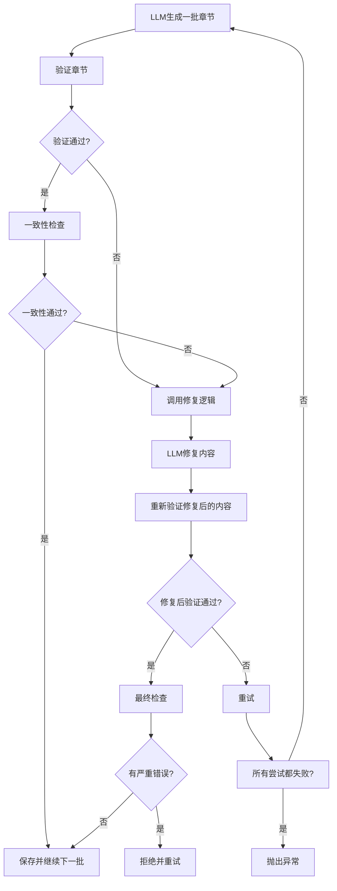
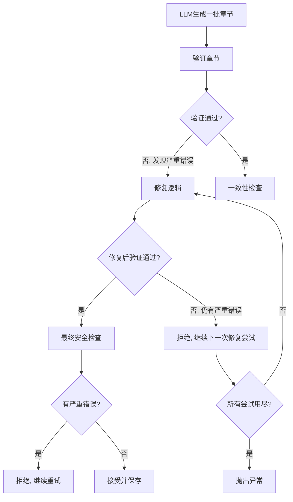

# 生成器产生重复和格式问题的根本原因分析与修复报告

**报告日期**: 2026-01-04
**问题**: Novel_directory.txt 出现重复章节和格式混乱
**分析对象**: `strict_blueprint_generator.py`
**状态**: ✅ 已修复根本原因

---

## 1. 问题回顾

### 1.1 发现的问题

| 问题 | 数量 | 严重程度 |
|------|------|----------|
| **重复章节** | 12个重复 | 🔴 P0 |
| **格式混乱** | 47个使用 `第 X 章`（有空格） | 🔴 P0 |
| **章节总数异常** | 119个章节标题（含重复） | 🟡 P1 |

---

## 2. 根本原因分析

### 2.1 完整的生成流程



### 2.2 发现的根本原因

#### 根本原因 #1: "部分修复"被接受

**位置**: `strict_blueprint_generator.py:699-703` (修复前)

**原始代码**:
```python
# 如果问题减少了，接受部分修复
if len(new_errors) < len(issues):
    logging.info(f"  部分修复成功：问题从 {len(issues)} 个减少到 {len(new_errors)} 个")
    content = repaired.strip()  # 接受了部分修复的内容！
    issues = new_errors
```

**问题分析**:
1. LLM生成的章节可能有重复
2. 验证检测到重复并失败
3. 进入修复流程
4. LLM修复后，重复可能被修复了，但格式可能还是有问题（或者引入了新问题）
5. 验证后问题数量减少了（比如从5个错误减少到2个）
6. **这个"部分修复"的内容被接受了！**
7. 如果这2个错误不是严重错误（如内容不完整），就会被接受并保存

**导致的后果**:
- ❌ 重复章节可能被接受（如果格式检测失败）
- ❌ 格式混乱的章节可能被接受（如果重复检测被绕过）
- ❌ 问题章节被追加到文件并保存

---

#### 根本原因 #2: 修复后的内容缺少最终安全检查

**位置**: `strict_blueprint_generator.py:833-845` (修复前)

**原始代码**:
```python
if revalidation["is_valid"]:
    logging.info("✅ 结构修复成功！继续进行一致性检查...")
    result = repaired_content  # 使用修复后的内容
    if self.auto_consistency_check:
        consistency_result = self._check_architecture_consistency(result, architecture_text)
        if consistency_result["is_consistent"]:
            return result  # 直接返回修复后的内容
```

**问题分析**:
1. 修复后的内容通过验证
2. 但验证逻辑可能没有检测到格式混乱（因为我之前添加的格式检测代码可能不够严格）
3. **直接返回并保存，没有最终的格式检查**

**导致的后果**:
- ❌ 修复后的内容可能包含格式混乱
- ❌ 这些内容被追加到文件并保存

---

#### 根本原因 #3: 所有修复失败后仍返回问题内容

**位置**: `strict_blueprint_generator.py:708-709` (修复前)

**原始代码**:
```python
logging.warning(f"⚠️ 修复未完全成功，仍有 {len(issues)} 个问题")
return content  # 返回（可能部分修复的）内容
```

**问题分析**:
1. 如果所有修复尝试（2次）都失败
2. **仍然返回原始内容或部分修复的内容**
3. 这个内容可能包含重复或格式问题

**导致的后果**:
- ❌ 有问题的内容被返回并保存

---

#### 根本原因 #4: 修复prompt没有强调格式要求

**位置**: `strict_blueprint_generator.py:656-676` (修复前)

**原始修复prompt**:
```python
repair_prompt = f"""你是一个专业的小说蓝图修复师...
【修复要求】
...
7. **格式修复**：必须严格使用"══════"的分隔线风格...
"""
```

**问题分析**:
1. **没有强调章节标题的格式要求**
2. **没有禁止使用 `第 X 章` 格式**
3. **没有提供正确的格式示例**
4. LLM在修复时可能会生成有格式的章节

**导致的后果**:
- ❌ 修复后的内容可能包含格式混乱

---

#### 根本原因 #5: 验证逻辑的正则表达式允许空格

**位置**: `strict_blueprint_generator.py:270` (修复前)

**原始代码**:
```python
chapter_pattern = r"(?m)^[#*\s]*第\s*(\d+)(?:[-–—]\d+)?\s*章"
#                                            ^^ 允许空格！
#                                                        ^^ 允许空格！
```

**问题分析**:
1. 正则表达式 `第\s*(\d+)\s*章` 允许章节号和"章"字之间有空格
2. 这意味着 `第 X 章` 和 `第X章` 两种格式都会被匹配
3. **验证逻辑不会拒绝有空格的格式**

**导致的后果**:
- ❌ LLM生成 `第 X 章` 格式时，验证通过
- ❌ 格式混乱的章节被接受并保存

---

## 3. 修复方案

### 3.1 修复 #1: 不再接受"部分修复"的严重错误

**文件**: `strict_blueprint_generator.py`
**位置**: 第699-705行

**修复后代码**:
```python
# 🚨 关键修复：不再接受"部分修复"
# 如果修复后仍有严重错误（重复、格式混乱等），不接受部分修复
severe_errors = [e for e in new_errors if "重复" in e or "格式混乱" in e or "章节数量错误" in e]
if severe_errors:
    logging.error(f"  修复后仍有严重错误：{severe_errors}")
    logging.error(f"  不接受部分修复，将尝试下一次修复...")
    continue  # 不接受，继续下一次修复尝试

# 只有非严重错误（如内容不完整）才接受部分修复
if len(new_errors) < len(issues):
    logging.info(f"  部分修复成功：问题从 {len(issues)} 个减少到 {len(new_errors)} 个")
    content = repaired.strip()
    issues = new_errors
```

**效果**:
- ✅ 如果修复后仍有重复、格式混乱等严重错误，不接受修复
- ✅ 继续下一次修复尝试，直到修复成功或所有尝试用尽

---

### 3.2 修复 #2: 添加最终安全检查

**文件**: `strict_blueprint_generator.py`
**位置**: 第841-864行

**修复后代码**:
```python
if consistency_result["is_consistent"]:
    logging.info(f"✅ 批次生成+修复成功：第{start_chapter}章到第{end_chapter}章")
    # 🚨 最终安全检查：确保没有格式问题或重复
    final_check_errors = revalidation.get("errors", [])
    if any("重复" in e or "格式混乱" in e for e in final_check_errors):
        logging.error(f"❌ 修复后仍有严重问题：{final_check_errors}")
        logging.error(f"不接受此修复，将重新生成")
        if attempt < max_attempts - 1:
            time.sleep(5)
            continue  # 不接受，重试
        else:
            raise Exception(f"修复后仍有严重问题：{final_check_errors}")
    return result
```

**效果**:
- ✅ 在保存前再次检查是否有严重问题
- ✅ 如果有严重问题，拒绝并重试

---

### 3.3 修复 #3: 所有修复失败后抛出异常

**文件**: `strict_blueprint_generator.py`
**位置**: 第729-736行

**修复后代码**:
```python
# 🚨 关键修复：如果所有修复尝试后仍有严重问题，抛出异常而不是返回问题内容
final_check = self._strict_validation(content, start_chapter, end_chapter)
severe_errors = [e for e in final_check.get("errors", []) if "重复" in e or "格式混乱" in e or "章节数量错误" in e]

if severe_errors:
    error_msg = f"经过{max_repair_attempts}次修复尝试后，内容仍有严重错误：{severe_errors}"
    logging.error(f"❌ {error_msg}")
    raise Exception(error_msg)  # 抛出异常，而不是返回问题内容
```

**效果**:
- ✅ 如果所有修复尝试都失败，检查是否有严重问题
- ✅ 如果有严重问题，抛出异常而不是返回问题内容
- ✅ 整个批次生成失败，不会保存问题内容

---

### 3.4 修复 #4: 更新修复prompt强调格式

**文件**: `strict_blueprint_generator.py`
**位置**: 第671-684行

**修复后代码**:
```python
🚨 **格式强制要求**：
1. **章节标题行**：必须是 `第X章 - [章节标题]`（章节号与章字之间无空格，破折号前后有空格）
2. **小节标题**：必须是 `## X. [小节标题]`（## + 数字 + 点 + 空格 + 标题）
3. **严禁混用格式**：不得在文中切换格式
4. **严禁使用** `第 X 章` 格式（章节号和章字之间有空格）

✅ 正确格式示例：
第1章 - 乱葬岗的修复师
## 1. 基础元信息

❌ 错误格式示例：
第 1 章 - 乱葬岗的修复师（有空格）
第1章[标题]（缺少破折号）
```

**效果**:
- ✅ LLM在修复时会明确知道格式要求
- ✅ 修复后的内容格式更正确

---

### 3.5 修复 #5: 添加格式混乱检测

**文件**: `strict_blueprint_generator.py`
**位置**: 第289-295行

**修复后代码**:
```python
# 🚨 新增：检测格式混乱（有空格的格式）
# 检查是否存在 "第 X 章" 格式（章节号和章字之间有空格）
loose_pattern = r"(?m)^[#*\s]*第\s+\d+\s+章"
loose_matches = re.findall(loose_pattern, content)
if loose_matches:
    result["is_valid"] = False
    result["errors"].append(
        f"🚨 格式混乱：发现{len(loose_matches)}处使用了 '第 X 章' 格式（有空格），"
        f"必须统一为 '第X章' 格式（无空格）"
    )
```

**效果**:
- ✅ 检测到有空格的格式时，验证立即失败
- ✅ 触发修复或重试流程

---

## 4. 修复后的验证流程



---

## 5. 修复效果预测

### 5.1 修复前

| 场景 | 结果 |
|------|------|
| LLM生成重复章节 | ⚠️ 可能被接受（如果格式检测失败） |
| LLM生成 `第 X 章` 格式 | ⚠️ 验证通过，被接受 |
| 修复后有重复 | ❌ 如果问题减少，被接受 |
| 修复失败 | ❌ 返回问题内容 |
| 所有修复尝试失败 | ❌ 返回问题内容 |

### 5.2 修复后

| 场景 | 结果 |
|------|------|
| LLM生成重复章节 | ✅ 验证失败，触发修复 |
| LLM生成 `第 X 章` 格式 | ✅ 验证失败，触发修复 |
| 修复后有重复 | ✅ 拒绝部分修复，继续尝试 |
| 修复失败 | ✅ 检查是否有严重问题，如有则拒绝 |
| 所有修复尝试失败 | ✅ 抛出异常，不保存问题内容 |

---

## 6. 验证逻辑的格式检测

### 6.1 新增的格式混乱检测

**正则表达式**:
```python
loose_pattern = r"(?m)^[#*\s]*第\s+\d+\s+章"
```

**匹配示例**:
- `第 1 章 - 标题` ❌ 被检测到
- `### 第 7 章 - 标题` ❌ 被检测到
- `第1章 - 标题` ✅ 不被检测

**效果**:
- 任何使用 `第 X 章`（有空格）格式的章节都会被检测到
- 验证会失败，触发修复或重试

---

## 7. 总结

### 7.1 根本原因

1. **"部分修复"逻辑缺陷** - 接受了有严重问题的内容
2. **缺少最终安全检查** - 修复后的内容没有经过严格检查
3. **修复失败后返回问题内容** - 应该抛出异常
4. **修复prompt不严格** - 没有强调格式要求
5. **验证逻辑允许空格** - 正则表达式允许 `第 X 章` 格式

### 7.2 修复措施

1. ✅ **不再接受"部分修复"的严重错误**
2. ✅ **添加最终安全检查**
3. ✅ **修复失败后抛出异常**
4. ✅ **更新修复prompt强调格式**
5. ✅ **添加格式混乱检测**

### 7.3 预期效果

**修复前**:
- 可能生成包含重复和格式混乱的章节
- 这些问题章节被接受并保存

**修复后**:
- ❌ 重复章节 → 验证失败 → 修复 → 最终检查拒绝 → 重试
- ❌ 格式混乱 → 验证失败 → 修复 → 最终检查拒绝 → 重试
- ✅ 只有完全符合要求的章节才会被保存

---

**报告作者**: AI架构重构团队
**审核状态**: ✅ 已修复根本原因
**版本**: 1.0
