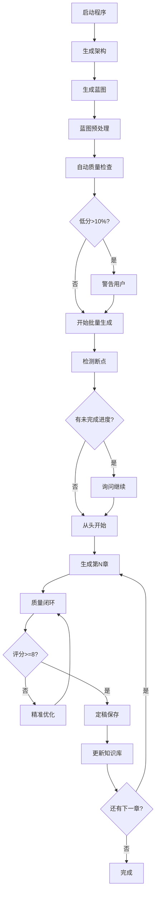

# AI小说生成程序完整工作流 (v3.0)

> 更新时间: 2025-12-10

---

## 阶段1：项目初始化

```
用户启动 main.py
    ↓
配置LLM参数（API Key, Model等）
    ↓
设置/选择小说项目目录
```

---

## 阶段2：架构设计

```
用户输入：主题、类型、章节数、世界观等
    ↓
点击"生成小说架构"
    ↓
LLM生成 → Novel_Architecture.txt
    ├─ 主角设定（姓名、身份、金手指）
    ├─ 修炼体系
    ├─ 世界观设定
    └─ 主线剧情大纲
```

---

## 阶段3：蓝图生成

```
点击"生成章节蓝图"
    ↓
分批生成所有章节详细蓝图 → Novel_directory.txt
    ↓
蓝图预处理 (BlueprintPreprocessor)
   ├─ 检测突破事件（修为进阶章节）
   ├─ 检测战斗事件
   ├─ 分配战斗风格（均衡算法，避免重复）
   └─ 生成 .blueprint_cache.json
    ↓
自动质量检查 (BatchQualityChecker)
   ├─ 检查蓝图格式规范性
   ├─ 统计平均质量分
   └─ 低分>10% 时弹窗警告用户
```

---

## 阶段4：单章闭环生产 ⭐ 核心流程

对于**每一章**，执行以下闭环：

```
┌─────────────────────────────────────────────────────────────────┐
│                      第N章生产线                                 │
├─────────────────────────────────────────────────────────────────┤
│                                                                  │
│  Step 1: Prompt构建 (build_chapter_prompt)                       │
│    ├─ 加载全局摘要、角色状态、前章摘要                            │
│    ├─ 注入战斗风格（从蓝图预处理结果）                            │
│    ├─ 注入修为约束（防境界崩坏）                                  │
│    ├─ 注入情感记忆（角色关系上下文）                              │
│    └─ 注入历史问题预警（学习机制）                                │
│                          ↓                                       │
│  Step 2: LLM生成初稿 (generate_chapter_draft)                    │
│    ├─ 调用配置的LLM生成内容                                       │
│    ├─ 语言纯度检查（中英混杂检测）                                │
│    ├─ 去重检测（与前文对比重复度）                                │
│    └─ 硬性校验（修为超标→自动修正）                               │
│                          ↓                                       │
│  Step 3: 质量闭环 (QualityLoopController)                        │
│    ┌────────────────────────────────────────────────────────┐   │
│    │  While 综合评分 < 8.0 且 迭代次数 < 3:                   │   │
│    │                                                         │   │
│    │    ① LLM语义评分 (8维度)                               │   │
│    │       └─ 剧情连贯性、角色一致性、写作质量...            │   │
│    │                                                         │   │
│    │    ② 一致性检查 (ConsistencyChecker)                   │   │
│    │       └─ 死者复活检测、境界回退检测                     │   │
│    │                                                         │   │
│    │    ③ 精准制导优化                                      │   │
│    │       └─ 专注最弱维度，量化指令（如"增加3处连接词"）    │   │
│    │                                                         │   │
│    │    ④ LLM深度精修重写                                    │   │
│    │                                                         │   │
│    │    ⑤ 学习机制记录（记录低分维度）                      │   │
│    │                                                         │   │
│    └────────────────────────────────────────────────────────┘   │
│                          ↓                                       │
│  Step 4: 定稿发布 (finalize_chapter)                             │
│    ├─ 保存 chapters/chapter_N.txt                                │
│    ├─ 更新 global_summary.txt                                    │
│    ├─ 更新 character_state.txt                                   │
│    ├─ 更新向量知识库                                             │
│    ├─ 更新一致性事实库 (.facts_db.json)                          │
│    └─ 更新情感记忆数据库 (.emotion_memory.json)                  │
│                          ↓                                       │
│  Step 5: 更新进度 (GenerationProgress)                           │
│    └─ 记录到 .generation_progress.json                           │
│                                                                  │
└─────────────────────────────────────────────────────────────────┘
                          ↓
                    进入第N+1章
```

---

## 阶段5：批量生成特性

```
点击"批量生成章节"
    ↓
断点续传检测
   └─ 如有未完成进度，询问"是否从断点继续？"
    ↓
循环执行阶段4（每章闭环生产）
    ↓
完成后标记进度为"completed"
```

---

## 质量保证层级

| 层级 | 检查模块 | 检查内容 | 处置方式 |
|------|---------|---------|---------|
| L1 | LLMAdapter | 格式错误、省略标记 | 重新生成 |
| L2 | ChapterValidator | 修为超标、风格不符 | 自动修正 |
| L3 | check_chapter_similarity | 内容重复度>15% | 警告/降分 |
| L4 | **QualityLoopController** | **8维度<8分** | **循环重写** |
| L5 | **ConsistencyChecker** | **死者复活、设定漂移** | **强制修正** |

---

## 数据文件说明

| 文件 | 用途 |
|------|------|
| `Novel_Architecture.txt` | 小说架构设定 |
| `Novel_directory.txt` | 章节蓝图 |
| `chapters/chapter_N.txt` | 生成的章节内容 |
| `global_summary.txt` | 全局剧情摘要 |
| `character_state.txt` | 角色状态追踪 |
| `.blueprint_cache.json` | 蓝图预处理结果 |
| `.generation_progress.json` | 批量生成进度 |
| `.problem_history.json` | 历史问题库 |
| `.facts_db.json` | 跨章事实库 |
| `.emotion_memory.json` | 情感记忆数据库 |

---

## 8维度评分标准

| 维度 | 评估内容 | 权重 |
|------|---------|------|
| 剧情连贯性 | 逻辑通顺，场景过渡自然 | 均等 |
| 角色一致性 | 行为符合人设，对话得体 | 均等 |
| 写作质量 | 文笔流畅，描写生动 | 均等 |
| 架构遵循度 | 符合小说整体规划 | 均等 |
| 设定遵循度 | 世界观、修炼体系一致 | 均等 |
| 字数达标率 | 内容充实（目标1000-1500字） | 均等 |
| 情感张力 | 有冲突、紧张感、情感起伏 | 均等 |
| 系统机制 | 体现修炼/升级/系统元素 | 均等 |

**达标阈值：综合评分 ≥ 8.0**

---

## 核心模块清单

| 模块 | 文件位置 | 功能 |
|------|---------|------|
| 章节生成 | `novel_generator/chapter.py` | 核心生成逻辑 |
| 质量闭环 | `novel_generator/quality_loop_controller.py` | 评分-优化循环 |
| 质量评分 | `chapter_quality_analyzer.py` | 8维度评分 |
| 蓝图预处理 | `novel_generator/blueprint_preprocessor.py` | 战斗风格分配 |
| 一致性检查 | `novel_generator/consistency_checker.py` | 跨章矛盾检测 |
| 学习机制 | `novel_generator/problem_learner.py` | 问题积累预防 |
| 断点续传 | `novel_generator/generation_progress.py` | 进度恢复 |
| 情感记忆 | `novel_generator/emotion_memory.py` | 角色关系追踪 |
| 章节校验 | `novel_generator/chapter_validator.py` | 硬性约束校验 |

---

## 流程图


